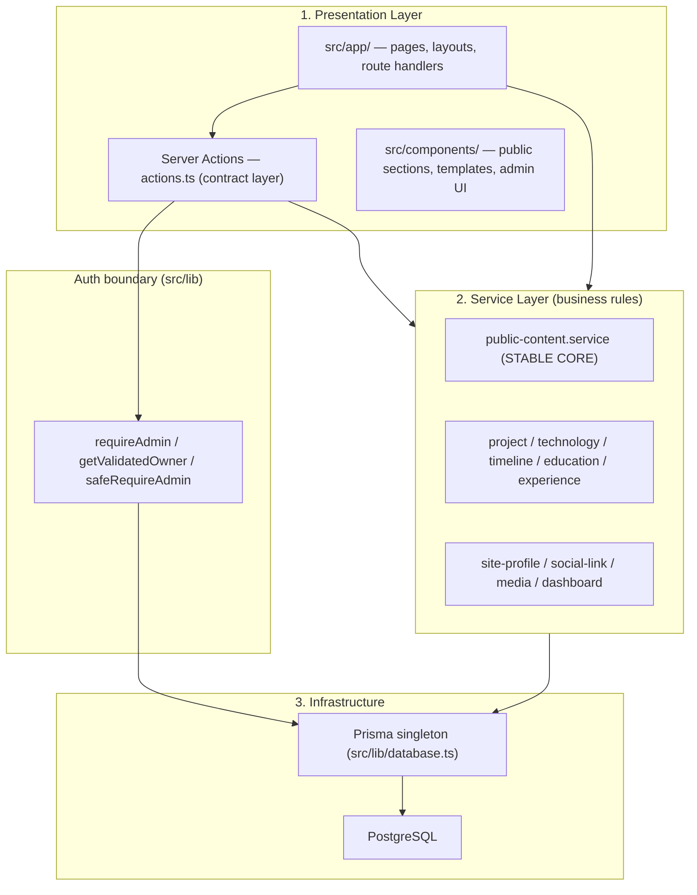

# Project Architecture

Modular boundaries for the Full-Stack Developer Portfolio with Admin CMS.
The goal is **development scalability**: new features attach at the edges
without forcing changes to the stable core, and modules connect through
contracts — not by reaching into each other's tables.

---

## 1. Layered Model (as built)



### Layer responsibilities

1. **Presentation (`src/app/`, `src/components/`)** — rendering and user input.
   Route files and layouts stay *thin*: authorize, call a service, render.
2. **Contract layer (Server Actions / route handlers)** — authentication
   (`requireAdmin` / `getValidatedOwner`), input validation (Zod), typed
   `{ success, data | error, fieldErrors }` responses, `revalidatePath`.
3. **Service layer (`src/services/`)** — all business rules, domain
   invariants, transactions, and audit logging. Services never do auth;
   callers pass an `auditContext`.
4. **Infrastructure (`src/lib/`, `src/prisma/`)** — Prisma singleton, auth
   config, password hashing, audit helper, env bindings.

> Note: the originally planned separate `src/repositories/` layer was folded
> into the service layer — services own their queries directly. With Prisma
> as the data mapper, a second repository abstraction added indirection
> without value at this project's scale.

---

## 2. The Rules

1. **Routes, pages, layouts, and Server Actions do not import `@/lib/database`.**
   They call a service. If the service doesn't exist, create one — don't
   inline queries. (Legacy exceptions: see Debt.)
2. **Each service owns one domain and its invariants** (e.g.
   `SocialLinkService` owns "one handle per platform"). Cross-domain features
   compose services; they never query another domain's tables.
3. **Services throw `Error` with user-safe messages; the contract layer maps
   them** to typed results. UI components consume contracts, never services.
4. **Related writes share one transaction inside the service** (see
   `SocialLinkService.reorder`, the publish flow, `initialize.js`).
5. **Connect domains by id, not by widening tables.** A new feature gets its
   own entity referencing existing ids — existing tables don't grow columns
   for someone else's feature.

## 3. Stable Core

`PublicContentService.getHomePageData()` is the CMS pipeline:

```
PUBLISHED (always)  → entity resolution (merge version rows, visibility filter, sort)
                    → section list (active PageVersion snapshot)
                    → template key (active version, else draft pointer)
```

**The public site renders PUBLISHED content and nothing else.** There is no
draft-preview path and no parameter that can switch this — the state is pinned
in the service, and `visible: false` rows are filtered in SQL. Anything
unpublished or hidden is unreachable from a public request by construction.
(A cookie-driven preview mode existed until it was removed; see
`docs/open-issues.md` item 3 for why.)

Every resolver here is wrapped in React `cache()` for request-scoped dedup —
that is what holds the 23-query homepage baseline in `docs/query-baseline.md`.

Everything else — auth, admin managers, themes, templates, analytics —
attaches around this pipeline. **Do not modify it to add a feature**; add a
service that composes with it.

## 4. Content Status Lifecycle

Two **independent** status axes run through the data model. Conflating them is
the single most common source of bugs in this area, so they are documented apart.

### Axis 1 — publish state (is it live?)

Every content edit writes a DRAFT; nothing reaches the public site until a
publish promotes it. `@@unique([entityId, state])` guarantees at most one row
per state, which is what lets DRAFT and PUBLISHED be paired by parent id.

| Record | Status column | Written by |
| --- | --- | --- |
| `ProjectVersion`, `TechnologyVersion`, `TimelineEntryVersion`, `EducationVersion`, `ExperienceVersion` | `state: PublishState` (DRAFT \| PUBLISHED) | domain services create/update the DRAFT; `POST /api/publish` upserts the PUBLISHED row |
| the same five | `visible: Boolean` | admin edit actions; filtered in SQL on the public read |
| `Project`, `Technology`, `TimelineEntry`, `Education`, `Experience` | `deletedAt` (soft delete) | `<Domain>Service.delete` / `.restore` |
| `Page` | `hasUnpublishedChanges` | ~40 service writes set it `true`; cleared by publish **and** by the self-heal in `GET /api/publish` |
| `Page` | `draftTemplateId` | `POST /api/templates` |
| `PageVersion` | `isActive`, `versionNumber`, `snapshot` | `POST /api/publish` **only** |
| `PageSection`, `SectionGroup` | `visible`, `order`, `groupId` | page-builder actions |
| `Template` | `isActiveLive` | `POST /api/publish` **only** |
| `Certification`, social links, `SiteProfile` | `visible` / direct fields | **applied immediately — no draft state.** Edits here are live at once |

**`hasUnpublishedChanges` is a hint, not a source of truth.** It is a sticky
one-way latch: many writes set it, only a publish clears it, and nothing
re-checks whether the edit actually changed anything. It is cheap enough for the
sidebar chip and the dashboard to read on every page load, and it over-reports
rather than under-reports. The authoritative answer is `computePublishDiff()`.

### The promotion contract

`src/services/publish-diff.service.ts` owns three shared constants, and **both**
the promotion (`POST /api/publish`) and the change detection (`GET /api/publish`,
`DashboardService`) are driven by them:

- **`PROMOTED_FIELDS`** — per entity, the exact columns a publish copies
  DRAFT → PUBLISHED.
- **`PROMOTION_DEFAULTS`** — non-nullable Json columns that promotion coerces
  (`externalLinks → {}`, `responsibilities → []`). The diff normalizes **both**
  sides through these; real data contains the coercion in both directions, and
  normalizing one side leaves a permanent phantom "changed" entry.
- **`buildSectionsSnapshot`** — the section snapshot shape, so the snapshot a
  publish writes is exactly what the diff compared against.

> **When you add a column to a version table, add it to `PROMOTED_FIELDS`.**
> This is not optional bookkeeping. `status`, `featured` and `showOnResume` were
> missing from `PROMOTED_FIELDS.project` for the project entity only — so editing
> a project's status in admin and publishing left the live page showing the old
> value **permanently**, and because the diff shares the same list, the UI
> truthfully reported "nothing to publish". A column absent from this list is
> invisible to both halves of the system at once.

### Axis 2 — editorial status (independent of publishing)

Unrelated to DRAFT/PUBLISHED. These are ordinary content fields that happen to
be named "status", and they are themselves subject to Axis 1 promotion.

| Record | Column | Values |
| --- | --- | --- |
| `ProjectVersion` | `status: ProjectStatus` | `COMPLETED \| IN_PROGRESS \| PLANNED` |
| `TimelineEntryVersion` | `status: ProjectStatus?` | same enum |
| `ContactMessage` | `status: MessageStatus` | `NEW \| READ \| REPLIED \| ARCHIVED` — no draft state, changes apply at once |

`ProjectStatus` has **no `ARCHIVED` member** — the admin project filters offered
one (plus a `MAINTAINED`) that could never match; both were removed. Soft-deleted
projects live under the Trash Bin filter (`deletedAt`), which is Axis 1.

### Publish flow (single writer)

`POST /api/publish` is the only path that mutates live state. In one transaction:
promote all five entity types → deactivate the prior `PageVersion` → create the
new one (`snapshot` + `templateKey`, `isActive: true`) → clear
`hasUnpublishedChanges` → flip `Template.isActiveLive` → audit.

## 5. Service Inventory

| Service | Domain |
| --- | --- |
| `public-content.service` | Public site data resolution (stable core) + layout chrome |
| `project.service` | Projects, versions, gallery, tech links |
| `technology.service` | Technologies + versions |
| `timeline.service`, `education.service`, `experience.service` | Their versioned entities |
| `media.service` | Uploads, replacement, usage tracking |
| `site-profile.service` | SiteProfile singleton |
| `social-link.service` | Social handles (order, visibility, duplicate rules) |
| `dashboard.service` | Admin dashboard aggregates |

## 6. Auth Boundary (do not bypass)

- `requireAdmin()` — admin pages/routes; validates JWT **and** TrackedSession;
  on failure redirects through `/api/auth/force-logout` (clears stale cookies,
  prevents redirect loops).
- `getValidatedOwner()` — public pages needing owner-only UI; returns `null`
  for guests, never redirects.
- `proxy.ts` — fast optimistic JWT-presence check only; never add DB calls.

## 7. Database Workflow

Schema changes go through the controlled commands — `npm run db:migrate`,
`db:push`, `db:setup`, `db:reset` — which chain Prisma → `initialize.js` →
`verify-initialization.js` (see README "Database Workflow"). Never run raw
prisma commands in the normal workflow.

## 8. Adding a Feature (checklist)

1. Model the domain entity; link to other domains **by id**.
2. Migrate via `npm run db:migrate`.
3. Create `src/services/<domain>.service.ts` with the business rules.
4. Add thin Server Actions (auth + Zod + typed results) calling the service.
5. Build UI against the action contracts.
6. Public rendering goes through `PublicContentService` (extend it or compose
   a new read service) — never query from a page file.

## 9. Debt (known rule violations)

Direct `db` imports remain in some older routes/pages: admin settings, game,
technologies, resume page, and several `/api/*` handlers. Rule: **when
touching one of these files, extract its queries into the owning service as
part of the change.** Do not add new violations.
