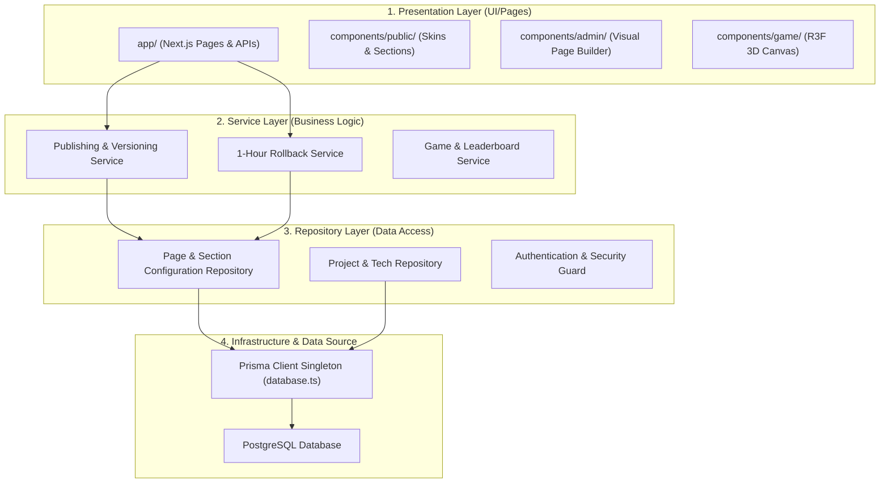

# Project Architecture & Work Order Roadmap

This document outlines the clean software architecture layers for the Full-Stack Developer Portfolio with Admin CMS and visualizes the sequential roadmap of implementation phases.

---

## 1. Clean Architecture Model

We adhere to a decoupled, layered architecture to separate user interfaces, business rules, database access, and configuration helpers.



### Layer Responsibilities

1. **Presentation Layer (`src/app/` & `src/components/`):**
   - Renders visual layout templates.
   - Binds styling properties via CSS variables (`[data-template]`).
   - Dispatches page-builder adjustments, template selections, and message submissions.

2. **Service Layer (`src/services/`):**
   - Contains pure business logic.
   - Manages version snapshot generation and rollback timer expirations.
   - Resolves custom keyframes into validated Framer Motion variants.
   - Coordinates multi-entity publishing confirmations.

3. **Repository Layer (`src/repositories/`):**
   - Isolates database query logic from API routes and services.
   - Standardizes database CRUD routines.
   - Handles soft-deletion filters (`deleted_at`).

4. **Infrastructure Layer (`src/lib/` & `src/prisma/`):**
   - Instantiates database connection singletons (Prisma client with pg driver adapters).
   - Manages environment variable configuration bindings.

---

## 2. Order of Work (Phased Roadmap)

To maintain a stable development lifecycle, we build dependency layers bottom-up:

```
[Phase 1: Foundations] ──> [Phase 2: Data Repositories] ──> [Phase 3: Service Layer]
                                                                     │
[Phase 6: Visual Templates] <── [Phase 5: Admin UI] <── [Phase 4: API Route Handlers]
         │
[Phase 7: 3D Sphere/Game] ──> [Phase 8: Polish & Deploy]
```

### Phase 1: Foundations & Setup (✅ Complete)
- Initialized Next.js 15 App, styling systems (Minimal, Glass, 3D), Prisma 7 configuration, PostgreSQL connection templates, and native password hashing libraries.

### Phase 2: Repository & Seed Layer (Next Step)
- Build database wrappers under `src/repositories/` for all entities.
- Write robust database seeder scripts (`prisma/seed.ts`) to populate standard templates, default pages, animation presets, and test projects.

### Phase 3: Services & Core Business Rules
- Implement rollback validations, version difference calculation algorithms, and snapshot engines under `src/services/`.

### Phase 4: API Endpoints (REST API)
- Create Next.js Route Handlers (`src/app/api/`) mapped to services.
- Guard admin endpoints with JWT/Session validation and write request validators using Zod.

### Phase 5: Admin Panel Interface
- Build CRUD dashboard views, sidebar frames, media libraries, and messages manager.
- Implement visual Page Builder canvas drag-and-drop mechanics (using `@dnd-kit`) and the keyframe editor timeline.

### Phase 6: Public Views & Template Skins
- Build reusable public sections (Hero, About, Timeline, Tech stack).
- Implement template variants (Professional Minimal, Modern Glass, Interactive 3D) swapping styling elements via CSS variables.

### Phase 7: 3D Interactions & physics
- Program the interactive floating tech-ball sphere using React Three Fiber.
- Set up fallback modes for touch, low-performance, or reduced-motion.
- Add physics-based falling ball basket game.

### Phase 8: Verification & Auditing
- Add E2E tests for the publishing and rollback flow.
- Audit performance, accessibility (Lighthouse checks), and responsiveness.
