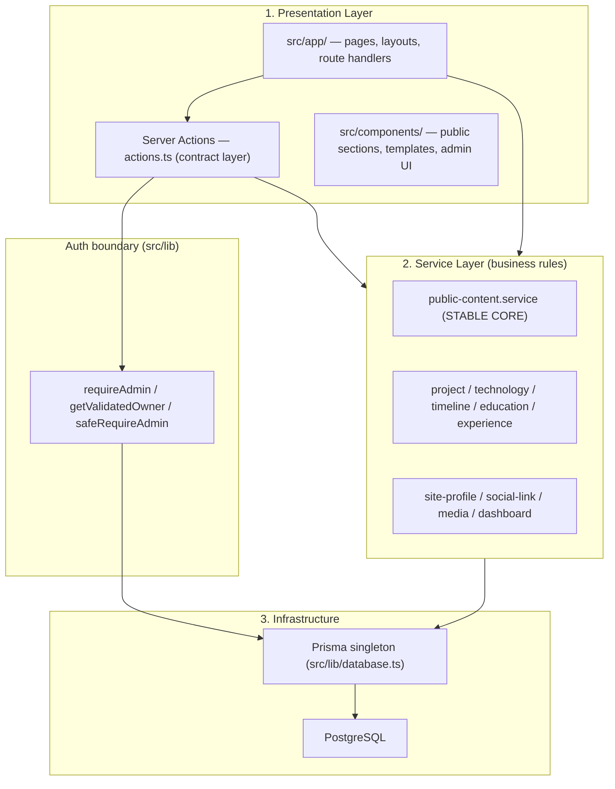

# Project Architecture

Modular boundaries for the Full-Stack Developer Portfolio with Admin CMS.
The goal is **development scalability**: new features attach at the edges
without forcing changes to the stable core, and modules connect through
contracts — not by reaching into each other's tables.

---

## 1. Layered Model (as built)



### Layer responsibilities

1. **Presentation (`src/app/`, `src/components/`)** — rendering and user input.
   Route files and layouts stay *thin*: authorize, call a service, render.
2. **Contract layer (Server Actions / route handlers)** — authentication
   (`requireAdmin` / `getValidatedOwner`), input validation (Zod), typed
   `{ success, data | error, fieldErrors }` responses, `revalidatePath`.
3. **Service layer (`src/services/`)** — all business rules, domain
   invariants, transactions, and audit logging. Services never do auth;
   callers pass an `auditContext`.
4. **Infrastructure (`src/lib/`, `src/prisma/`)** — Prisma singleton, auth
   config, password hashing, audit helper, env bindings.

> Note: the originally planned separate `src/repositories/` layer was folded
> into the service layer — services own their queries directly. With Prisma
> as the data mapper, a second repository abstraction added indirection
> without value at this project's scale.

---

## 2. The Rules

1. **Routes, pages, layouts, and Server Actions do not import `@/lib/database`.**
   They call a service. If the service doesn't exist, create one — don't
   inline queries. (Legacy exceptions: see Debt.)
2. **Each service owns one domain and its invariants** (e.g.
   `SocialLinkService` owns "one handle per platform"). Cross-domain features
   compose services; they never query another domain's tables.
3. **Services throw `Error` with user-safe messages; the contract layer maps
   them** to typed results. UI components consume contracts, never services.
4. **Related writes share one transaction inside the service** (see
   `SocialLinkService.reorder`, the publish flow, `initialize.js`).
5. **Connect domains by id, not by widening tables.** A new feature gets its
   own entity referencing existing ids — existing tables don't grow columns
   for someone else's feature.

## 3. Stable Core

`PublicContentService.getHomePageData(isPreview)` is the CMS pipeline:

```
isPreview → version state (DRAFT | PUBLISHED)
          → entity resolution (merge version rows, visibility filter, sort)
          → section list (draft rows | active PageVersion snapshot)
          → template key
```

Everything else — auth, admin managers, themes, templates, analytics —
attaches around this pipeline. **Do not modify it to add a feature**; add a
service that composes with it.

## 4. Service Inventory

| Service | Domain |
| --- | --- |
| `public-content.service` | Public site data resolution (stable core) + layout chrome |
| `project.service` | Projects, versions, gallery, tech links |
| `technology.service` | Technologies + versions |
| `timeline.service`, `education.service`, `experience.service` | Their versioned entities |
| `media.service` | Uploads, replacement, usage tracking |
| `site-profile.service` | SiteProfile singleton |
| `social-link.service` | Social handles (order, visibility, duplicate rules) |
| `dashboard.service` | Admin dashboard aggregates |

## 5. Auth Boundary (do not bypass)

- `requireAdmin()` — admin pages/routes; validates JWT **and** TrackedSession;
  on failure redirects through `/api/auth/force-logout` (clears stale cookies,
  prevents redirect loops).
- `getValidatedOwner()` — public pages needing owner-only UI; returns `null`
  for guests, never redirects.
- `proxy.ts` — fast optimistic JWT-presence check only; never add DB calls.

## 6. Database Workflow

Schema changes go through the controlled commands — `npm run db:migrate`,
`db:push`, `db:setup`, `db:reset` — which chain Prisma → `initialize.js` →
`verify-initialization.js` (see README "Database Workflow"). Never run raw
prisma commands in the normal workflow.

## 7. Adding a Feature (checklist)

1. Model the domain entity; link to other domains **by id**.
2. Migrate via `npm run db:migrate`.
3. Create `src/services/<domain>.service.ts` with the business rules.
4. Add thin Server Actions (auth + Zod + typed results) calling the service.
5. Build UI against the action contracts.
6. Public rendering goes through `PublicContentService` (extend it or compose
   a new read service) — never query from a page file.

## 8. Debt (known rule violations)

Direct `db` imports remain in some older routes/pages: admin settings, game,
technologies, resume page, and several `/api/*` handlers. Rule: **when
touching one of these files, extract its queries into the owning service as
part of the change.** Do not add new violations.
